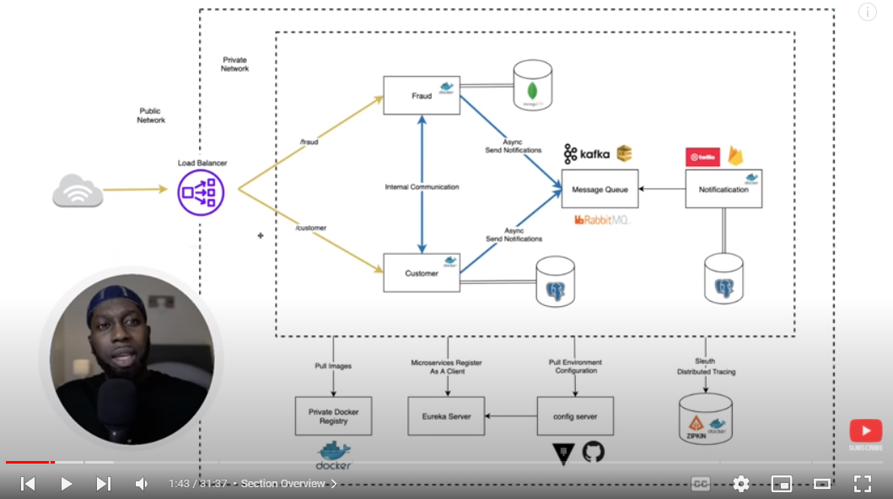

# Spring Cloud Microservices Example

taken from amigoscode with <3

- <https://www.youtube.com/playlist?list=PLwvrYc43l1Mwqpf9i-1B1gXfMeHOm6DeY>
- <https://github.com/amigoscode/microservices>

## Running

### docker (for le database)

    docker-compose up -d
    # optional below
    docker-compose ps
    docker-compose logs -f

2. Manually create the following databases using PGAdmin:

   - `fraud`
   - `customer`

Then visit <http://localhost:5050/> to view PGAdmin.

Note the hostname is "postgres" (coming from the docker network) - not localhost.

### spring app

    # apply environment variables
    source DEV.env

    # build and run
    mvn spring-boot:run

or use intellij idea to run :3c

## issues

### Invalid interpolation format

Your `docker-compose` version is probably old. Update with a binary from <https://github.com/docker/compose/releases>
